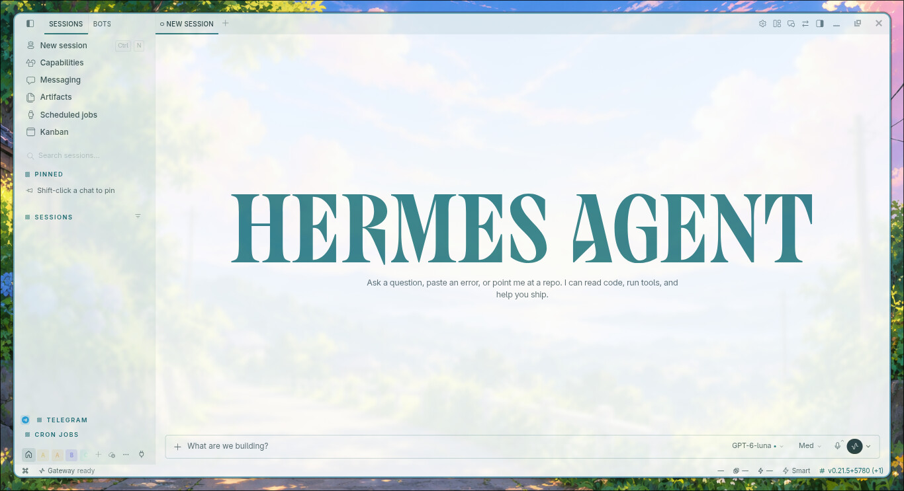
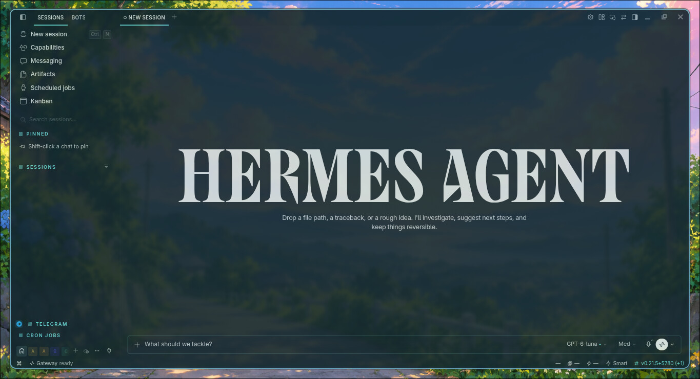

# Glass Theme for Hermes

Glass Theme is a glass theme for Hermes Desktop. It pairs a white and gray light palette with a teal-toned dark palette, translucent internal surfaces, soft layers, and blur where the host supports them, while preserving readable text and controls.

The package uses Hermes' native Desktop Plugin SDK. It registers one `DesktopTheme` in `THEMES_AREA`, including light and dark palettes, a matching ANSI terminal palette, and CSS limited to surfaces that the host exposes to plugins. It does not modify Hermes core.

## Features

- Light and dark themes in Hermes' native theme picker.
- Internal translucency and blur where the host and surface support them.
- Target contrast of at least 4.5:1 for normal text and 3:1 for controls, icons, and focus states.
- Readable disabled states without global opacity.
- Terminal palettes designed for Hermes' concrete terminal canvas.

The transparency applies only inside Hermes. This plugin does not make the native window transparent over the desktop and cannot control operating-system vibrancy, materials, or compositor rules.

## Preview

### Light mode



### Dark mode



## Compatibility

Glass Theme requires Hermes Desktop and Hermes Agent `>=0.21`. It is a unified package: `plugin.yaml` describes the package, `__init__.py` is an inert compatibility entry point for the Agent loader, and `desktop/plugin.js` registers the Desktop theme. The Agent entry point registers no tools and changes no configuration.

Install only code that you have reviewed. Plugins run in the Desktop process, so retain access to the repository in case you need to remove the package.

## Install from GitHub

Install the published repository with Hermes' plugin CLI, then enable the package:

```bash
hermes plugins install mykeura/glass-theme-for-hermes --no-enable
hermes plugins enable glass-theme
```

Hermes installs the package at `$HERMES_HOME/plugins/glass-theme`; no manual copying of `desktop/plugin.js` is required. Reopen Hermes Desktop and select **Glass** in the native theme picker. If the theme is missing or still shows an older description after an update, use **⌘K → Reload desktop plugins**.

To revert, select another Desktop theme. To disable or remove the package, run `hermes plugins disable glass-theme` or `hermes plugins remove glass-theme`. Do not edit or delete Hermes core files.

## Window opacity on Linux

Glass Theme does not control native window opacity. On Linux, a compositor such as Hyprland can apply that effect outside the plugin. The following rule was used in this environment with the observed Hermes window class:

```lua
hl.window_rule({
    name = "hermes-opacity",
    opacity = "0.9 0.6",
    match = { class = "^(com\\.nousresearch\\.hermes)$" }
})
```

The first value applies to the active window and the second to an inactive window. Verify the class with `hyprctl clients` before reusing the rule, because another Hermes version or distribution may use a different identifier. Windows and macOS need a compatible window-management utility for comparable per-window opacity; this plugin cannot provide it.

## Development and verification

The Desktop SDK loads `desktop/plugin.js` directly, without a build step. Run the following checks before a release:

```bash
npm run check
hermes plugins validate .
hermes plugins doctor . --ci
```

Static checks do not replace a visual check in a compatible Hermes Desktop session.

## Support

If you find Glass Theme useful, you can support my work through [GitHub Sponsors](https://github.com/sponsors/mykeura).

[My Nous Portal referral link](https://portal.nousresearch.com/r/mykeura) gives new Personal subscribers **$15 off** and gives me a **$10 referral credit**. Both options are entirely optional, but appreciated.

## License

This project is licensed under the [MIT License](LICENSE).
